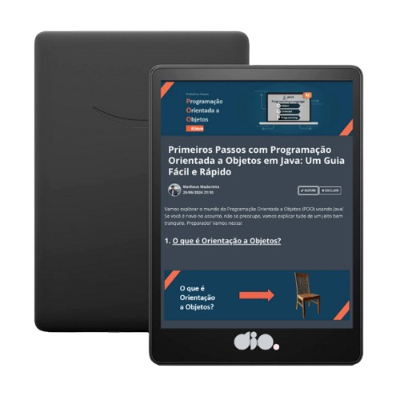

    

  
  

-------

  

# Projeto artigo técnico gerado por I.A.s

 > ℹ️ **NOTE:** Este é o repositório desenvolvido durante o curso no qual fui aluno na plataforma da [DIO](https://dio.me).

Projeto com o objetivo de gerar um artigo técnico com um layout rico, leitura agradável e com foco em promover sua autoridade técnica.

<a href="https://web.dio.me/articles/primeiros-passos-com-programacao-orientada-a-objetos-em-java-um-guia-facil-e-rapido?back=%2Farticles&open-modal=true&page=1&order=oldest" title="View PDF now"> 📕Clique aqui para ler o artigo</a>

## 💻 Tecnologias utilizadas no projeto

- [ChatGPT](https://chat.openai.com/) - título e conteúdo
- [Lexica.art](https://lexica.art/) - gerar imagens
- [PowerPoint](https://www.microsoft.com/en/microsoft-365/powerpoint) - formatação de banners e Layouts

## 📄 Prompts e ferramentas

ChatGPT：

|   Ação   | prompt                                                                                                                                                                                                                                                                         |
| :------: | ------------------------------------------------------------------------------------------------------------------------------------------------------------------------------------------------------------------------------------------------------------------------------ |
|  título  | crie 10 headlines para nome de artigos sobre o assunto: Programacão Orientada a Objetos - Java, gerando interesse para um estudante iniciante |
| conteúdo | Comporte-se como um escritor de artigo tech, e escreva um artigo de acordo com as {REGRAS} abaixo: {REGRAS}: - Divida o artigo em blocos/tópicos para melhor entendimento; - No máximo 5 linhas por bloco de explicação; - Deverá ser escrito em uma linguagem relativamente informal; - A linguagem de programação base para a explicação é JAVA; - Os tópicos a serem criados são respectivamente: 1.O que é orientaçao a objetos(com 1 exemplo simples em Java); 2. Objetos; 3. Classes; 4. Herança; 5. Polimorfismo; 6. Encapsulamento; - Escreva de uma forma mais informal, para que um completo iniciante entenda |

Lexica.art：

- No léxica utilizamos o acervo público de imagens geradas por outras pessoas, os termos de pesquisa que utilizei foram:

• Java language
• OOP Java

## ✨ Features

- Conteúdo gerado via ChatGPT
- Imagens do acervo público geradas via Lexica.art

## 📚 Materiais

- prompts utilizados

## 🛠️ Instruções de execução

Utilize os prompts acima nas ferramentas sugeridas para gerar o material base e utilize uma ferramenta de edição de documentos como power point, libreoffice , indesign para diagramação, o passo a passo em vídeo pode ser conferido na plataforma da [DIO](https://dio.me).

----
